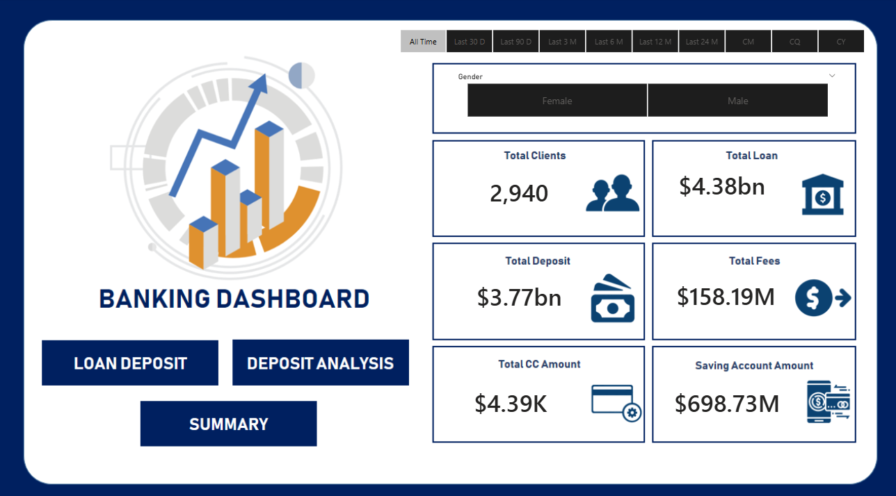

# Customer Behavior Analysis & Banking Performance for FinTech
An interactive Power BI dashboard designed to explore customer and financial trends in the banking sector. It visualizes metrics like total loans, deposits, savings, fees. The dashboard enables users to filter by gender, banking relationship, and timeframe.

## Executive Summary:
Using SQL, Python for exploratory data analysis (EDA) and Power BI for visualization, this project analyzes a bank’s customer and transaction data to surface insights around loans, deposits, savings, credit-card usage and customer engagement.

---
### Problem Statement:
Banks depend on clear visibility into customer financial behavior to drive lending, deposits, and revenue growth. Excel reporting is fragmented, making it difficult to track key KPIs across demographics, income bands, and engagement levels. This limits the bank’s ability to identify trends, risks, and high-value customer segments. How can we create a unified analytics solution that delivers real-time insights into customer behavior and overall banking performance?

---
### Methodology:
  1. Connected to the MySQL database and extracted the raw banking data into Jupyter Notebook.
  2.    Performed exploratory data analysis (EDA) in Python using pandas, matplotlib, and seaborn to clean, summarize, and understand customer financial behavior.
  3.  Modeled and transformed the processed data for reporting purposes.
  4.    Built an interactive Power BI dashboard to visualize key banking KPIs, segment customer groups, and deliver actionable financial insights.

---
### Visuals - Power BI Dashboard Preview

---
### Skills
SQL:
Basic MySQL database connection and data extraction using mysql-connector-python.
Power BI:
DAX measures, calculated columns, data modeling, data cleaning & transformation (categorical mapping, data type fixes), KPI creation, interactive dashboards, slicers, navigation, financial data visualization.
Python:
Pandas, NumPy, Matplotlib, Seaborn, exploratory data analysis (EDA), descriptive statistics, correlation analysis, relationship visualization.  

---
### Results & Business Recommendation:
The analysis highlighted differences in financial behavior across income bands, nationalities, and engagement levels. High-income customers maintain significantly higher loan and deposit balances, while younger engagement groups contribute less overall value. Additionally, the correlation study showed strong relationships between deposits, savings behavior, and business lending, indicating opportunities for targeted cross-selling.
The dashboard can provide stakeholders a clear view of key banking KPIs across loans, deposits, savings, and customer engagement. With this visibility, teams can now self-serve insights that previously required manual reporting, reducing ad-hoc analysis time and improving decision-making efficiency.

Based on these findings, I recommend focusing on the following actions to improve financial performance:
  1.Prioritize high-value customer segments by enhancing relationship-based products for high-income and long-engagement clients.
  2.Improve savings and deposit growth by creating targeted campaigns for mid-income groups showing strong positive correlations with deposit behavior.
  3.Leverage nationality-based insights to personalize product offerings for regions demonstrating higher loan uptake or stronger deposit patterns.
  4.Enhance early-engagement strategies to increase value from newer customers, who currently show lower loan and deposit contributions.

---
### Future Scope
  1. Integrate Predictive Analytics: Add machine learning models to forecast loan defaults, deposit growth, or customer churn using the existing dataset.
  2. Automate Data Pipelines: Replace manual imports with automated ETL workflows so the dashboard updates directly from MySQL on a schedule.
